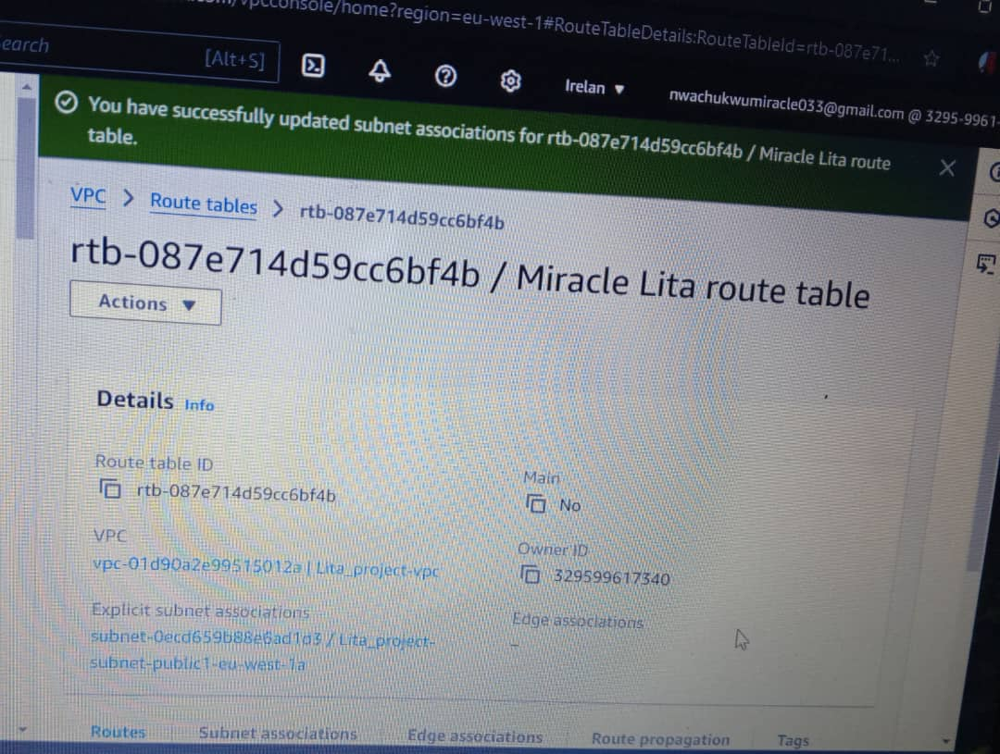

 # Miracle lita _project
 This process document the me creating a security group.
 ### STEPS ON HOW I CREATED MY SECURITY group
 First i named my security group, Added a description to it allowing SSH and HTTP traffic Next selected the vpc that was created by lita for this project, I added an inbound rule, that any SSH and HTTP traffic should be allowed 
 I also added an outbound rule that all traffic should be allowed. then i created my security group 
 below is a screenshot
 
# CREATED MY ROUTE TABLE 
I created a route table using the lita VPC 
below is my screenshot

 
   